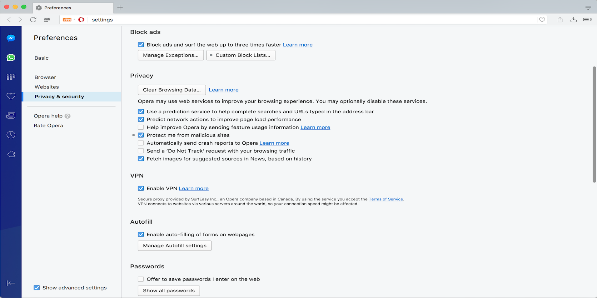
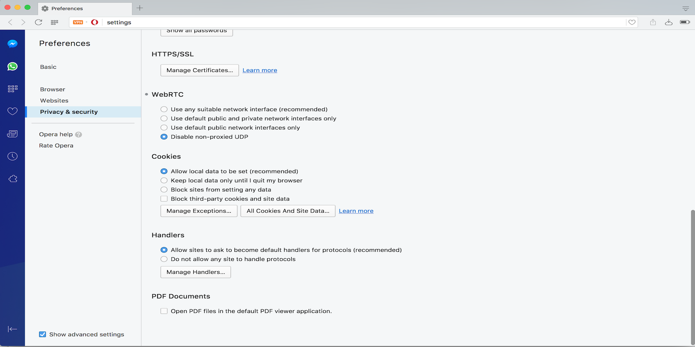
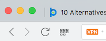
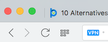
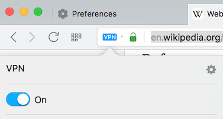
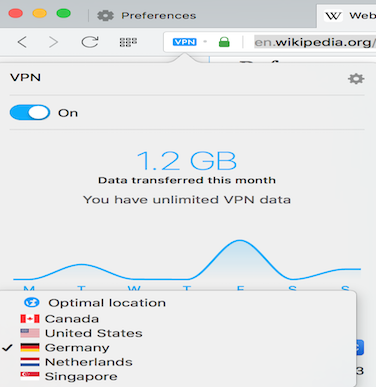

\captionsetup[table]{labelformat=empty}

# Introduction  

Opera is one of the popular browsers that are widely used for surfing the internet. In January 2016, in addition to other implemented security and privacy features such as private browsing window, native ads blocker etc., Opera browser added an unlimited and free Virtual Private Network (VPN) client in a new browser product named Opera Developer currently at beta development stage. With VPN feature, Opera is replacing the physical IP addresses of its users with virtual IP addresses to protect users' privacy online.  

VPN uses a combination of dedicated connections and encryption protocols to generate virtual peer-to-peer connections. It is originally being used by corporations to securely access a private network and share data remotely through public networks. However, in recent times, the technology has gained much popularity among individual users primarily as a means to protect sensitive personal information on the web and enhance internet users privacy.  

The purpose of this report is to evaluate the usability of Opera Developer browser from the perspectives of non-technical users installing and configuring the VPN and other security features of the browser for internet privacy.  

# Evaluation Methodology
Opera Developer browser usability will be carried out using a cognitive walk-through methodology. Specific core tasks will be defined, performed and evaluated using guidelines adapted from Clark et al.(2007)[1]. Compliance or violation of any of the guidelines' requirements by each of the core tasks to be performed will be noted by indicating the guideline code alphabets (e.g. G1, G2,...G8) after relevant observations relating to the core tasks.

## The Core Tasks  
The following 4 core tasks will be performed in our cognitive walk-through steps.   
**CT-1:** Successfully install Opera Developer browser and confirm that basic internet security and privacy settings are available and are easily configurable for users.  
**CT-2:** Successfully configure Opera Developer to work with the VPN provided by the browser.  
**CT-3:** Confirm that the VPN provide more than one alternative virtual IP addresses and locations for users to pick from and that the VPN is actually functioning by ascertaining that the user's local IP address and physical location details change to virtual IP address and location whenever the user activates the VPN.    
**CT-4:** Confirm that certain advanced security settings in the browser have been preconfigured to default values in a way to protect users' security and enhance the browser usability.  

## Usability Guidelines
Each of the core tasks will be evaluated using the following set of guidelines from Clark et al.(2007)[1].  
**G1:** Users should be aware of the steps they have to perform to complete a core task.  
**G2:** Users should be able to determine how to perform these steps.  
**G3:** Users should know when they have successfully completed a core task.  
**G4:** Users should be able to recognize, diagnose, and recover from non-critical errors.  
**G5:** Users should not make dangerous errors from which they cannot recover.  
**G6:** Users should be comfortable with the terminology used in any interface dialogues or documentation.  
**G7:** Users should be sufficiently comfortable with the interface to continue using it.  
**G8:** Users should be aware of the application’s status at all times.

## Core Task 1: Opera Developer Installation
Opera Developer browser can be easily installed by users for example on Mac, by double clicking an installer file downloaded via a conspicuous link displayed on Opera site https://www.opera.com/computer/beta. The installer walks a user through the installation process and adequately informs the user on the completion of the process. This complies with usability guideline requirement G3.  

## Core Task 2: Security Settings and Configuration 
We observed that Opera Developer browser provides a set of basic internet security and privacy settings as shown below. 

 

We also noticed that the interface is relatively comfortable to use and the settings are easily understandable for an average user to configure without hassles (G7). Additionally, Opera Developer also provides a "Learn more" links beside relevant settings that require further information for users to make an informed configuration decision. The configuration interface is generally intuitive and requires less hand-holdings in terms of steps that users need to take when configuring the browser and how to perform the steps. This is in compliance with requirements G1 and G2.

We however observed that WebRTC setting and its options may be difficult for an average user to comprehend. Although the browser indicates a recommended option, a non-technical user that wants to express independence in her choice may find the technical jargons and the options puzzling. This is a violation of requirement G6.  

WebRTC (Web Real-Time Communication) actually refers to a group of protocols and APIs (application programming interfaces) that enable browsers communicate real-time over peer-to-peer connections. It allows browsers to share and transfer media files real-time without the need for plugins [2]. The need for users to understand webRTC and its configuration options is even more important considering a reported security concern [3] where WebRTC was found to be exposing real IP addresses of VPN users.

The core task of configuring the VPN bundled with Opera Developer browser is relatively easy. Users are first require to check off a box on the settings page to enable the VPN. Further information on the VPN and the associated terms of service are also clearly outlined. This is in agreement with requirements G1 and G2. Upon enabling the VPN, the user can confirm that the VPN is up by noticing the VPN logo on top left corner of the browser changing from orange to blue as shown below. The orange colour indicates when the VPN is off and the blue colour shows when it is active. These steps comply with usability requirement G8 as it allows the user to be aware of the browser status at all times.

                                                                 

The user can further can click on the VPN logo and either turn off or on the VPN by dragging the white button as shown below to the left or right. Although this task does not require any technical skill, we noted that the step to get the VPN on or off is not clearly highlighted anywhere on the browser's settings interface. This flouts usability requirements G1, G2 and G3.   

## Core Task 3: Virtual IP Addresses and VPN Functionality 
Opera Developer browser provides more than one alternative virtual IP addresses and locations as shown below. To select any of the available IP addresses, the user will have to click on the VPN logo on top left corner of the browser and pick the IP address and virtual location of their choice. This step may not be easily discernible for users to carry out as it is not clearly stated on the browser configuration interface. Hence, it violates requirements G1, G2 and G3. 

Although a VPN IP address is displayed any time a user selects a new virtual location, the user still needs to perform extra tasks to actually confirm the VPN functionality by noting that the browser's IP address has changed from the existing physical IP address to the newly selected virtual one. User is not expressly aware of these steps and how she is going to perform them. This is not in agreement with requirements G1 and G2.

## Core Task 4: Preconfigured Advanced Security Settings
We noted that certain advanced security settings in Opera Developer browser as shown below have been preconfigured with default values in a manner that promote users' security and enhance usability. A key objective of preconfigured settings is to save users from tampering with critical system settings that may lead to dangerous errors from which the system may not recover. This is in compliance with requirement G5.

# Conclusion
We evaluated the usability of Opera Developer browser using a cognitive walk-through methodology that is based on a set of defined core tasks and guidelines. Our results indicate that the browser is generally usable without much difficulty for non-technical users to install and configure the security and privacy settings of the browser.

# References  
[1] J. Clark, P. Van Oorschot, and C. Adams, *“Usability of anonymous web browsing: an examination of Tor interfaces and deployability,”* Soups, pp. 41–51, 2007.  
[2] https://en.wikipedia.org/wiki/WebRTC?oldid=767671854. Accessed on 2017-03-13.  
[3] *Huge Security Flaw Leaks VPN Users’ Real IP-addresses TorrentFreak.com* https://torrentfreak.com/huge-security-flaw-leaks-vpn-users-real-ip-addresses-150130/. Accessed on 2017-03-13.