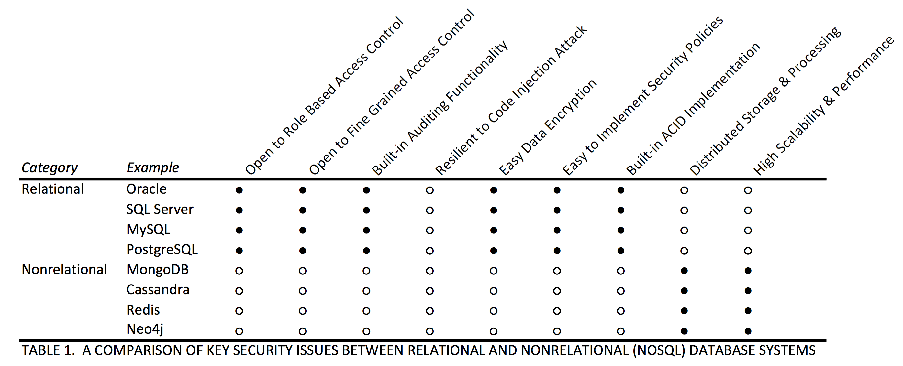

\captionsetup[table]{labelformat=empty}

#Introduction
At the heart of various information systems driving operations and activities in public, governmental or private, small and large businesses is a database system [@Vimercati2002]. Database provides backend storage structure where data can be stored persistently and retrieved for different usages. In a certain sector of an economy, for example the financial industry, database plays a critical role in processing, storing and retrieval of vital financial transactions data on online and mobile banking platforms, payment systems, stock exchange and funds transfer systems. Database has been leveraged, not only by enterprise stand-alone and web solutions but also by cloud applications in providing reliable and continous services to clients.  

Furthermore, database is also routinely deployed in computer internal logging systems where there are needs to store historical system events or users' activities for audit and other purposes. For example, Firefox browser is known to log users' browsing activities and web surfing history in certain databases in the users' computers and devices. Microsoft and other similar companies have also deployed several internal or in-memory databases in their software and hardware systems for various purposes.

Generally, a database can be considered as a persistent store of related data that are facts with implicit meaning. It is a logical collection of interconnected data that represents certain aspects of real-world events or entities that must be collected, processed and made available to users [@Vimercati2002].

Database system is typically designed and developed based on a given data model which is a conceptual model representing the data, the interrelationships between its entities and the rules to manage operations on the data objects [@Hamilton2005]. The aggregation of software systems and infrastructure that provide the functionalities for data definition, maintenance and access in a database is referred to as a database management system (DBMS) [@Vimercati2002]. 

#Database Classification
Databases are broadly classified as relational and non-relational. The concept of a relational database model was first developed by Edgar Codd in his 1970 seminal paper titled: "A Relational Model of Data for Large Shared Data Banks". The model essentially described the following key features of a relational database [@Harrison2015]: *Tuple* - an unordered set of values that corresponds to a row and a column attribute value in an actual database system. *Relation* - a collection of tuples that corresponds to a table in a database implementation. *Constraints* - a set of rules to enforce database consistency and useful in identifying tuples and their relationships. *Operations* - this refers to database operations such as joins, unions etc. on relations.

Closely related to the relational database model is a concept of database transaction that describes the way relational database processes concurrent data change request. A transaction represents a transformation of data state with the properties of *Atomicity* - indivisibility of transaction implying changes are either completely applied to the database or no effect at all, *Consistency* - the database is consistent before and after changes are applied, *Isolation* - a transaction should not be impacted by other ongoing transactions and *Durability* - changes committed to the database should be persistent and should survive failure of the underlying operating system or hardware [@Gray1981; @Harrison2015].

The relational database system provides structured query language (SQL) as a data access and manipulation language. SQL was standardized in 1986 by ANSI (American National Standards Institute). The  query language has been revised seven times since then with the most recent version being SQL2011  or  ISO/IEC  9075:2011  (International Organization  for Standardization/International Electrotechnical Commission) [@Lake2013].

Since its discovery in 1970, the relational database has proved hugely popular with organizations and businesses requiring persistent storage of data. In recent years, however, the massive amounts of user-generated content in social media and unstructured data from other sources such as RFIDs, GPS data, sensors data and metadata have pushed the limits of relational databases in terms of storage and performance scalability and have compelled researchers and organizations to look into nonrelational or "NoSQL" database system as an alternative to address these requirements efficiently [@Corbellini2017]. 

NoSQL database is a class of database system that does not follow the conventional relational database model descriptions of tables, schema and SQL as a query and manipulation language. The functions, purpose and approaches of a given variety of NoSQL database may be different but what is common to them all is that they are not relational. Their key advantage over the relational database is that they are far more efficient in handling unstructured data. They scale well in distributed settings in terms of storage and performance than relational database system. NoSQL databases have also been found easy to work with by developers that are not conversant with the SQL query language of the relational database model [@Leavitt2010].

NoSQL databases can be categorized into four basic types [@Leavitt2010; @Vaish2013; @Harrison2015; @Tarzey2016]:  
* _Key-Value_: this database is based on key and values where indexed data are stored as values that can be retrieved by keys. Examples of key value based NoSQL databases include Redis, SimpleDB and MemcacheDB.  
* _Column-oriented_: this database consists of one extendable column where related data are stored. Examples of column-oriented NoSQL databases include Cassandra and HBase.  
* _Document-oriented_: this database stores data as structured documents (mostly in XML or JSON formats) in which users can include any number of fields of any length to the document. Examples of document-oriented NoSQL databases include MongoDB and Couchbase.  
* _Graph-oriented_: graph databases are special NoSQL databases with a focus on relationship between entities (nodes). They are optimized for easy representation, data retrieval and relationship manipulation among the nodes in the system. Examples of graph databases include Neo4j and OrientDB.

#Database Threats and Security Concerns
Key security objectives for all databases are Confidentiality, Integrity and Availability [@Vimercati2002]. Database confidentiality requires that information or data warehoused in a database is not disclosed to unauthorized entities. This also means that unauthorized individuals should not have access in any form to the database. Integrity involves a database being able to resist unauthorized modifications to objects and data. Users with restricted rights should not be able to manipulate database objects on which they are not granted modification privileges. The security objective of availability requires database services to be readily available to authorized individuals or application users without any form of service denials.

As a result of database critical role as a repository for valuable information and data, enterprise database system has become a target of a wide range of threats. Top ten among the significant threats that can negatively impact database security goals include[@Shulman2006]:  
1.  _Excessive Privilege Abuse_: Database privileges may be abused or used for malicious purposes when a database access rights granted to a user are far more than what the job functions of the user require.  
2.  _Legitimate Privilege Abuse_: Legitimate users may abuse their privileges by intentionally accessing or negligently storing confidential information from databases on their local computers. Such data are vulnerable to stealing or other forms of abuse.  
3.  _Privilege Elevation_: Unpatched vulnerabilities in a database may allow attackers take over database administrative account thereby gaining unrestricted access to the database files, data and information.  
4.  _Database Platform Vulnerabilities_: Vulnerabilities in the background operating system driving the database infrastructure as well as installation of malicious additional services on database server can allow attackers gain unauthorized access, steal or corrupt critical data.  
5.  _SQL Injection_: Attackers often target web applications with unauthorized database statements via their input interfaces with an objective of gaining unrestricted access to the backend database.  
6.  _Weak Audit Trail_: To allow their malicious database activities go unrecorded and undetected, attackers often turn off, wipe off or disable weak database audit trails after they had gained privileged access to the system.  
7.  _Denial of Service_: This is an attack category where legitimate users are denied database services by attackers flooding the network and overwhelming the servers' resources (memory, CPU, etc.) with request overloads.  
8.  _Database Communication Protocol Vulnerabilities_: Security vulnerabilities in database communication protocols or API may allow attackers gain an unauthorized access to the database.  
9.  _Weak Authentication_: Where authentication scheme is weak, the identity of a legitimate database user may be taken over by attackers either through brute force, credential theft or by social engineering.  
10. _Backup Data Exposure_: Database information is exposed to theft where backup database storage media (e.g. tapes and hard disks) are not properly kept and left unprotected. 

## Key Security Issues of NoSQL Databases
The diferences in structures and variety in types of NoSQL databases has presented unique challenges for adopting a common security approach for NoSQL databases. However, experts and vendors agreed on the fundamental NoSQL database security requirements that organizations must address. These are authentication (user identification), access control, encryption and auditing [@Heller2015]. 

The objective of this report is to develop an evaluation framework for assessing and comparing security of relational and NoSQL database systems with focus on the top ten database security threats identified by Shulman [@Shulman2006] as well as key security concerns stated by Heller [@Heller2015]. In addition, scalability and performance of relational and NoSQL database systems will also be compared.

# Evaluation Framework
This section presents an evaluation framework for assessing and comparing security features and functionalities in the two broad classes of database systems based on nine criteria. Each criterion is described in relation to the database system being assessed with further explanations on the security characteristics and features being compared. 

  

**Open to Role Based Access Control (RBAC)**: RBAC is an access control administration model that requires system access and resources to be provisioned to a user based on his or her role in an organization. In this model, a set of functions and related permitted system access level required for the role functions are defined and mapped to the role based on the company security policies. Users' profiles are then created and mapped to the relevant roles. For relational database systems, this features are embedded in the database out of the box ($\bullet$). NoSQL database systems lack this key security requirement from their developers ($\circ$).  
**Open to Fine Grained Access Control**: Fine grained access control refers to a mechanism used in implementing and enforcing security policies on database objects such as tables. For example, a system administrator might control access of a particular individual or system user to certain data by defining row-level security rules on tables warehousing such data. This feature is built-in in relational database system ($\bullet$). NoSQL database system does not fully adopt this security requirement in its design ($\circ$).  
**Built-in Auditing Functionality**: Relational database systems are equipped out of the box with auditing functionality to track and log details of users' activities and changes made to the database ($\bullet$). This feature is yet to be fully implemented in NoSQL database system ($\circ$).  
**Resilient to Code Injection Attack**: Security against code injection attack is not built inherently into both database systems. Malicious SQL can be injected in a relational database to steal or corrupt data while unauthorized javascripts can be used to attack NoSQL database system.  
**Easy Data Encryption**: As a result of non-distributed settings in which most relational databases operate, it is easier and more cost effective to protect data at rest by way of encryption ($\bullet$) than in NoSQL database ($\circ$) where the data is distributed among different nodes in clusters. 	
**Easy to Implement Security Policies**: Overall, organizational security policies require less efforts to implement in relational database ($\bullet$) than in NoSQL database system ($\circ$). In addition, central administration of security policies is easily achieved in relational database system than in NoSQL database.  
**Built-in ACID Implementation**: Relational database tend to be more stable and consistent ($\bullet$) than NoSQL database ($\circ$) because of the strict requirements of Atomicity, Consistency, Isolation and Durability (ACID) implemented to ensure database transactions and changes are properly committed.  
**Distributed Storage & Processing**: The distributed environment in which NoSQL databases operate provides better flexibility in storing data across different nodes in a cluster arrangement ($\bullet$). In addition, the ability of NoSQL databases in processing vast amount of unstructured and semistructured data are far more superior to that of relational database system ($\circ$).  
**High Scalability & Performance**: NoSQL databases ($\bullet$) scale and perform better in handling data than relational database system ($\circ$).  

# Conclusion
Security evaluation of relational and nonrelational (NoSQL) database systems was carried out. It was found that security features in relational database system, especially those on access controls are well developed and integrated than in NoSQL database systems. High scalability, flexible storage capability and massive processing power in handling unstructured and semistructured data are key strenghts of NoSQL database system. However, it is expected that more security layers will be integrated into NoSQL database system as the industry and the technology mature.  

# References